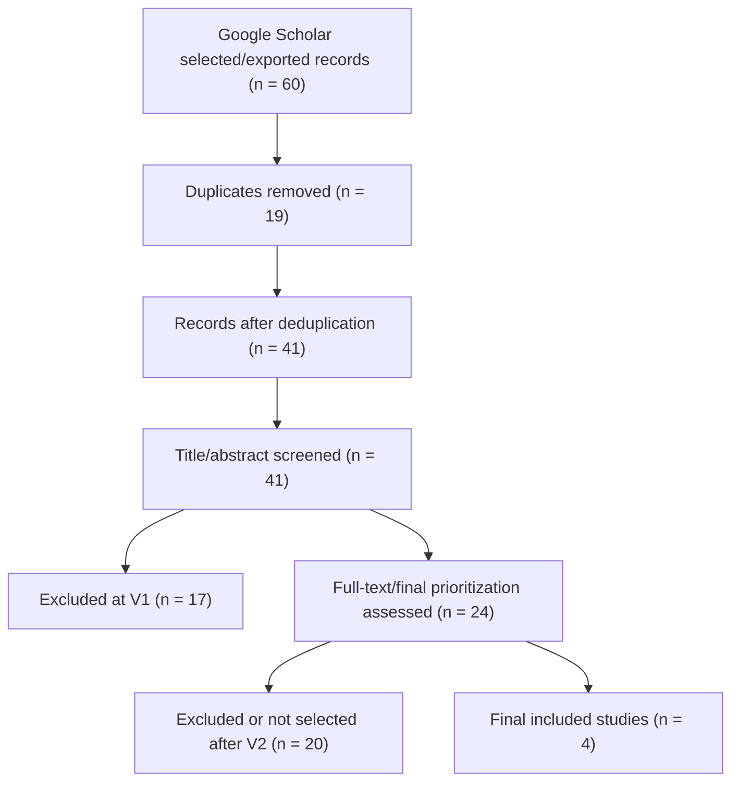

# PRISMA Flow - Khang Google Scholar

## Identification

Records identified from Google Scholar raw search hits: 2909

Records selected/exported before deduplication: 60

## Deduplication

Records before deduplication: 60  
Duplicate records removed: 19  
Records after deduplication: 41

## Screening V1 - Title and Abstract

Records screened: 41  
Records excluded at V1: 17  
Records included at V1: 19  
Records unsure at V1: 5  
Records included or unsure for full-text: 24

## Screening V2 - Full Text

Full-text/final-prioritization papers assessed: 24  
Full-text/final-prioritization papers excluded or not selected: 20  
Final included papers: 4

## Consistency Check

- Rows in `SLR/01_all_records.csv` = 41.
- Rows in `SLR/02_after_screening_v1.csv` = 41.
- Count(`v1_decision = EXCLUDE`) = 17.
- Count(`v1_decision = INCLUDE or UNSURE`) = 24.
- Rows in `SLR/03_final_included.csv` = 4.

