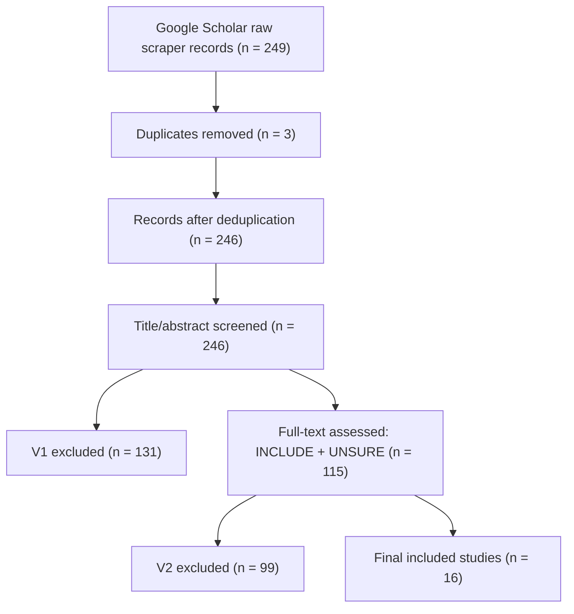

# PRISMA Flow - Khang Google Scholar

## Identification

Records identified from Google Scholar using one PICO-based search string: 249

Records exported from scraper: 249

## Deduplication

Records before deduplication: 249
Duplicate records removed: 3
Records after deduplication: 246

## Screening V1 - Title and Abstract

Records screened: 246
Records excluded at V1: 131
Records included at V1: 45
Records unsure at V1: 70
Records included or unsure for full-text: 115

## Screening V2 - Full Text / Final Prioritization

Full-text/prioritization papers assessed: 115
Full-text/prioritization papers excluded: 99
Final included papers: 16

## Consistency Check

- Rows in `SLR/01_all_records.csv` = 246.
- Rows in `SLR/02_after_screening_v1.csv` = 246.
- Count(`v1_decision = EXCLUDE`) = 131.
- Count(`v1_decision = INCLUDE`) = 45.
- Count(`v1_decision = UNSURE`) = 70.
- Count(`v1_decision = INCLUDE or UNSURE`) = 115.
- Rows in `SLR/03_final_included.csv` = 16 (only the final included papers).
- Count(`v2_decision = INCLUDE`) = 16.
- Final included N = 16 > 5, so the SLR passes the RBL-2 minimum paper gate.
- Rows in `SLR/evidence-table.md` = 16.

