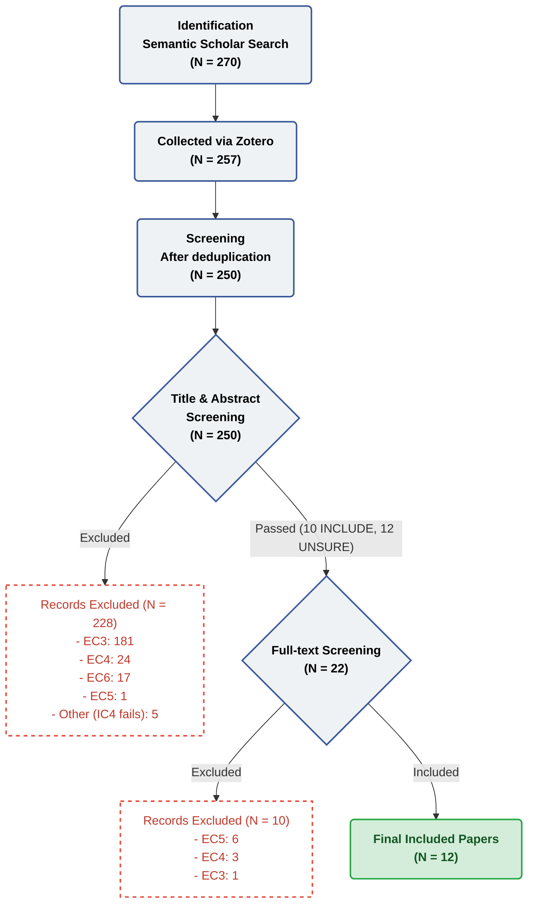

# PRISMA Flow Diagram

### Screening Steps Detail

| Step | Details |
|---|---|
| Identification | 270 records identified from Semantic Scholar raw search (see search-log.md for details). 257 records were successfully collected via Zotero for screening.|
| Deduplication | Removed 7 duplicates, 250 records kept into screening. |
| Screening v1 (Title and Abstract) | Screened 250 records. Excluded 228 records at v1. 10 INCLUDE and 12 UNSURE kept to round 2 |
| Screening v2 (Full-text) | Screened 22 records in detail. Excluded 10 records at v2. |
| Final Inclusion | 12 records for evidence_table.csv. |

**Consistency Check:**
- Rows in 01_all_records.csv after deduplication = 250 
- Count(v1_decision = EXCLUDE) in 02_after_screening_v1.csv = 228
- Count(v1 = INCLUDE + UNSURE) in 02_after_screening_v1.csv = 22
- Count(v2_decision = EXCLUDE) in round 2 full-text screening = 10
- Count(v2_decision = INCLUDE) exclusively in 03_final_included.csv = 12 => Included in evidence_table.csv
