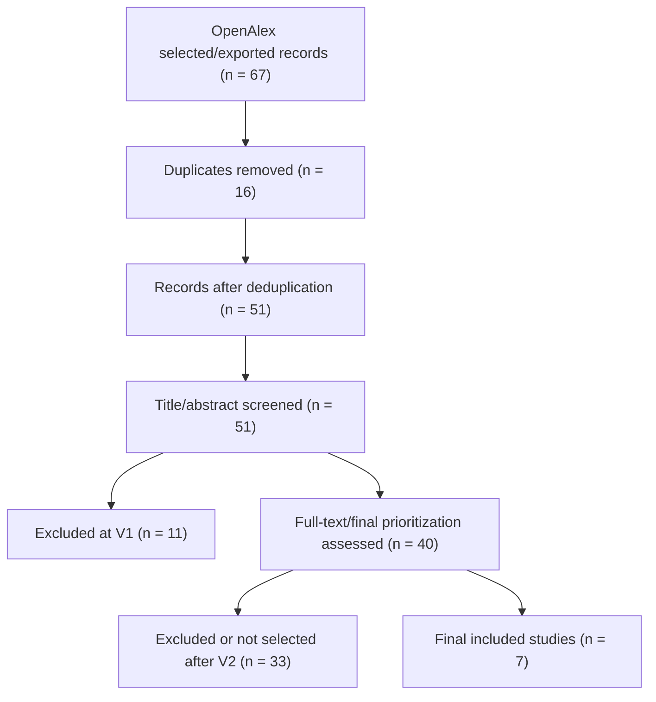

# PRISMA Flow - Phuoc OpenAlex

## Identification

Records identified from OpenAlex raw search hits: 119

Records selected/exported before deduplication: 67

## Deduplication

Records before deduplication: 67  
Duplicate records removed: 16  
Records after deduplication: 51

## Screening V1 - Title and Abstract

Records screened: 51  
Records excluded at V1: 11  
Records included at V1: 36  
Records unsure at V1: 4  
Records included or unsure for full-text: 40

## Screening V2 - Full Text

Full-text/final-prioritization papers assessed: 40  
Full-text/final-prioritization papers excluded or not selected: 33  
Final included papers: 7

## Consistency Check

- Rows in `SLR/01_all_records.csv` = 67.
- Rows in `SLR/01_all_records_dedup.csv` = 51.
- Rows in `SLR/02_after_screening_v1.csv` = 51.
- Count(`v1_decision = EXCLUDE`) = 11.
- Count(`v1_decision = INCLUDE or UNSURE`) = 40.
- Rows in `SLR/03_final_included.csv` = 7.

