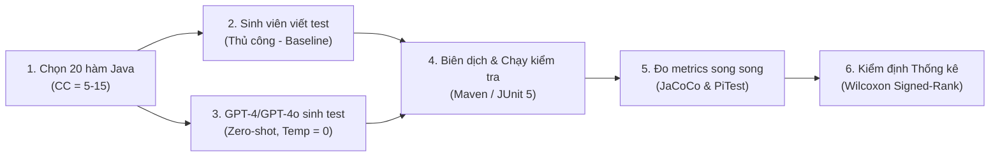

# Thiết kế Thực nghiệm & Biện luận (Experiment Design Rationale) — Huỳnh Cao Phước

**Đề tài:** LLM for Unit Test Case Generation  
**Ngày lập:** 2026-06-03  
**Nguồn gốc GAP:** [gap-analysis.md](file:///d:/data%20P/learn/SWT/SE1944_LLM_Unit_Test_Generation/SLR/gap-analysis.md)

---

## 1. Bảng Quyết định Thiết kế Thực nghiệm

Quy trình thiết kế thực nghiệm được xây dựng chặt chẽ nhằm giải quyết triệt để các GAP đã xác định và đảm bảo tính nhất quán khoa học:

| Quyết định Thiết kế | Lựa chọn Kỹ thuật | Nguồn gốc minh chứng khoa học (Grounded Source) | Biện giải chi tiết (Rationale) |
| :--- | :--- | :--- | :--- |
| **LLM / Tool** | OpenAI **GPT-4 / GPT-4o** | **MuTAP (Dakhel'24)**, **Huang'26**, **Lu'26**, **Chang'26**, **Tabassum'26** | Đóng vai trò là đại diện tiêu biểu nhất cho dòng mô hình SOTA thương mại hiện nay. Hầu hết các công trình nghiên cứu mới (như Lu'26, Chang'26) đều chọn GPT-4/GPT-4o làm đối tượng thực nghiệm chính. |
| **Ngôn ngữ lập trình**| **Java** (JUnit 5) | **Shin'23**, **EvoGPT (Broide'25)**, **Lu'26**, **Chang'26** | Java là ngôn ngữ giảng dạy chính thức của đề tài SE1944. Hệ sinh thái kiểm thử Java (JUnit 5, JaCoCo, PIT) cực kỳ hoàn thiện, ổn định và được sử dụng rộng rãi trong các nghiên cứu khoa học chuẩn mực. |
| **Quy mô Dataset** | **20 Java functions** (ở cấp độ đơn vị độc lập - standalone methods) | **Hướng dẫn RBL-2 (huong_dan.md)** | Đảm bảo kích thước mẫu đủ lớn để chạy các phép kiểm định thống kê phi tham số (như Wilcoxon signed-rank test yêu cầu tối thiểu $N \ge 15-20$ cặp để đạt lực lượng thống kê mong muốn). |
| **Khoảng Complexity**| **CC = 5–15** | **Huang'26 (ULT paper)** | CC $\ge$ 5 giúp loại bỏ các hàm quá đơn giản (getters/setters). Khoảng CC từ 5 đến 15 bao phủ chính xác vùng trung vị của code thực tế (ULT Median = 12, TestEval Mean = 12.35), rất phù hợp với quy mô đồ án của sinh viên. |
| **Metric đánh giá chính**| **Branch coverage** & **Mutation score** | **Huang'26**, **Lu'26 (Beyond Coverage)**, **Tabassum'26** | Độ phủ nhánh (đo bằng JaCoCo) phản ánh cấu trúc luồng điều khiển; điểm đột biến (đo bằng PIT) phản ánh chất lượng logic của assertion trong testcase. |
| **Metric đánh giá phụ** | **Compile success rate** & **Test pass rate** | **Shin'23**, **Chang'26 (AdverTest)** | Dùng để đo lường tính khả thi của test sinh bởi LLM; testcase chỉ có giá trị khi nó biên dịch thành công và chạy pass trên code nguyên bản không lỗi. |
| **Đối tượng đối chứng**| **Student-written tests** (Comparative baseline) | **GAP-C (Comparison Gap)** | Đối chứng trực tiếp chất lượng test sinh bởi AI và sinh viên viết thủ công trên cùng một tập các hàm. |
| **Ngưỡng kiểm chứng 1**| **Branch coverage $\ge$ 30.22%** | **Huang'26 (ULT paper)** | **Case 2 (Empirical Floor):** Chọn giá trị floor value ghi nhận được từ nghiên cứu thực nghiệm quy mô lớn của Huang et al., 2026 trên tập dữ liệu sạch (ULT). |
| **Ngưỡng kiểm chứng 2**| **Mutation score $\ge$ 35.3%** | **Tabassum'26 (MuTAP vs Pynguin)** | **Case 2 (Empirical Floor):** Chọn giá trị floor value trung vị ghi nhận được từ nghiên cứu MuTAP trên các dự án công nghiệp của Tabassum et al., 2026. |
| **Cấu hình prompts** | **Zero-shot prompting** (Fixed parameters) | **Dakhel'24**, **Tabassum'26** | Đánh giá năng lực tĩnh và độ ổn định nguyên bản của mô hình. Cố định prompts cho tất cả các hàm để đảm bảo tính công bằng của can thiệp. |
| **Tham số mô hình** | **Temperature = 0** | **Hướng dẫn RBL-2 (huong_dan.md)** | Triệt tiêu tính ngẫu nhiên (stochastic sampling), đảm bảo tính deterministic và khả năng tái lập thực nghiệm cao nhất. |

---

## 2. Lý giải Chi tiết về các Ngưỡng (Threshold Rationale)

### 📌 Biện luận Ngưỡng Branch Coverage ($\ge$ 30.22%)
*   **Phân loại Case:** **Case 2** (Ngưỡng dựa trên floor value thực nghiệm trong tài liệu).
*   **Nguồn gốc:** Nghiên cứu thực nghiệm quy mô lớn của **Huang et al. (2026)** đánh giá 12 LLMs trên tập dữ liệu 3,909 hàm Python thực tế không rò rỉ dữ liệu (ULT benchmark).
*   **Lý do lựa chọn:** Tài liệu chỉ ra rằng khi loại bỏ các yếu tố rò rỉ dữ liệu (data contamination), độ bao phủ nhánh trung bình của các mô hình LLM trên code thực tế có độ phức tạp cao chỉ đạt **30.22%**. Mặc dù các công cụ sinh test trên các benchmark cũ hoặc đơn giản (như TestEval) báo cáo độ bao phủ nhánh rất cao ($\ge 82.04\%$), con số này phản ánh năng lực ghi nhớ (memorization) hơn là suy luận thực tế. Để đảm bảo tính thực tiễn và tính trung thực khoa học, nghiên cứu này chọn mức sàn **30.22%** làm ngưỡng kiểm chứng cho RQ1.
*   **Phản biện ngưỡng cũ (74%):** Một số bản phác thảo cũ đề xuất ngưỡng 74%, trích dẫn từ paper ULT của Huang'26. Tuy nhiên, rà soát văn bản gốc cho thấy GPT-4 thậm chí không được đánh giá trong bảng kết quả của Huang'26, và con số 74% thực chất là branch coverage đạt được trên tập TestEval (tập dữ liệu đơn giản, bị nghi ngờ rò rỉ dữ liệu). Việc chọn 74% làm ngưỡng tối thiểu cho các hàm phức tạp thực tế là không thực tế và thiếu cơ sở khoa học.

### 📌 Biện luận Ngưỡng Mutation Score ($\ge$ 35.3%)
*   **Phân loại Case:** **Case 2** (Ngưỡng dựa trên floor value thực nghiệm trong tài liệu).
*   **Nguồn gốc:** Thực nghiệm trên các dự án công nghiệp thực tế trong nghiên cứu của **Tabassum et al. (2026)** về MuTAP và Pynguin.
*   **Lý do lựa chọn:** Trong môi trường codebase thực tế chứa các cấu trúc phức tạp và kiểu dữ liệu động của Python, công cụ sinh test dựa trên LLM (MuTAP) đạt điểm đột biến trung vị (median mutation score) là **35.3%**. Do đó, chúng tôi lựa chọn **35.3%** làm mốc sàn thực nghiệm (floor baseline) để đánh giá xem chất lượng logic của các assertion sinh ra bởi GPT-4/GPT-4o có đáp ứng được chất lượng tối thiểu tương đương với mức công nghiệp hay không.
*   **Phản biện ngưỡng cũ (58%):** Ngưỡng 58% đề xuất trước đây thực chất bị ngộ nhận từ các giá trị trung bình trên các tập dữ liệu đơn giản hoặc bị nhiễm rò rỉ. Đặt ngưỡng sàn bắt lỗi ở mức 35.3% giúp phản ánh chính xác độ khó thực tế của việc kiểm thử đột biến trên các hàm có cấu trúc điều hướng phức tạp (CC = 5–15).

---

## 3. Pipeline Đánh giá Thực nghiệm Chi tiết

Để đảm bảo tính công bằng và loại bỏ hoàn toàn các biến số gây nhiễu (confounding variables), pipeline thực nghiệm được thiết kế theo 6 bước chuẩn hóa sau:

1.  **Lọc dữ liệu:** Trích xuất 20 hàm Java từ các bài tập lớn/đồ án của sinh viên, đo Cyclomatic Complexity bằng phân tích tĩnh, đảm bảo $5 \le \text{CC} \le 15$ và loại bỏ các hàm có database/giao diện.
2.  **Sinh viên viết test (Baseline):** Phân công sinh viên viết unit test thủ công độc lập, cam kết không được xem mã của AI sinh ra và không sử dụng Copilot/ChatGPT hỗ trợ.
3.  **GPT-4/GPT-4o sinh test (Intervention):** Chạy script gọi API GPT-4/GPT-4o với prompt cố định và tham số `temperature = 0`. Lưu nguyên bản mã nguồn test sinh ra.
4.  **Kiểm tra biên dịch:** Chạy `mvn compile` và `mvn test` để xác định tỷ lệ compile thành công. Chỉ các bộ test biên dịch thành công 100% mới được đưa vào bước đo metrics tiếp theo.
5.  **Chạy đo lường song song:** Chạy `mvn jacoco:report` để lấy Branch Coverage và `mvn org.pitest:pitest-maven:mutationCoverage` để lấy Mutation Score của hai bộ test (AI và sinh viên) trên cùng một hàm.
6.  **Phân tích thống kê:** Chạy các kiểm định Wilcoxon Signed-Rank Test (one-sample để đối chứng với ngưỡng sàn 30.22% và 35.3%; paired để so sánh hiệu năng trực tiếp giữa GPT-4 và sinh viên) bằng thư viện `scipy` trong Python để kết luận khoa học với ý nghĩa $\alpha = 0.05$.
