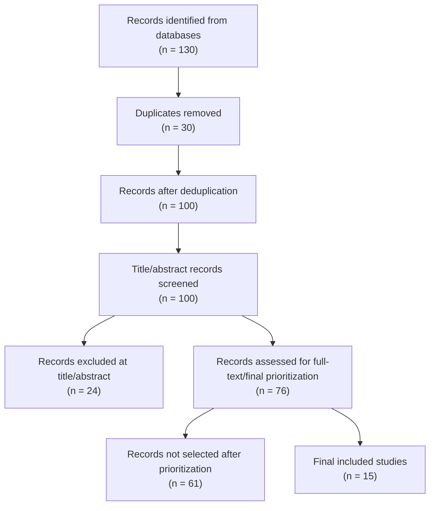

# PRISMA Flow

This file records the RBL-1 paper search, screening, and selection flow, including final selection for evidence extraction.

## Search Procedure

1. Derive search strings from PICO using three concept groups: LLM/GPT, unit test generation, and evaluation metrics such as branch coverage, code coverage, mutation score, and mutation testing.
2. Search multiple academic sources and log each source in `search_log.csv`: Google Scholar, IEEE Xplore, ACM Digital Library, Semantic Scholar, arXiv, and CORE.
3. Export source-level records into raw files such as `raw_records_google_scholar.csv`, `raw_records_ieee.csv`, `raw_records_acm.csv`, `raw_records_semantic_scholar.csv`, and `raw_records_arxiv_core.csv`.
4. Merge all raw records into `01_all_records.csv`.
5. Deduplicate by DOI/title-level matching into `01_all_records_dedup.csv`.
6. Run title/abstract screening in `02_after_screening_v1.csv` using `ie_criteria.md`.
7. Read and prioritize the `INCLUDE` and `UNSURE` records for full-text/final selection. Selection prioritizes papers that directly support the current RQ: Java/JUnit or Python/pytest unit test generation, branch/code coverage, mutation score, and comparison baselines.
8. Write the selected final papers into `03_final_included.csv`.

## Current Counts

| Stage | Count | Source File |
| --- | ---: | --- |
| Records identified | 130 | `01_all_records.csv` |
| Duplicates removed | 30 | `01_all_records.csv` vs `01_all_records_dedup.csv` |
| Records after deduplication | 100 | `01_all_records_dedup.csv` |
| Records screened by title/abstract | 100 | `02_after_screening_v1.csv` |
| Title/abstract INCLUDE | 62 | `02_after_screening_v1.csv` |
| Title/abstract UNSURE | 14 | `02_after_screening_v1.csv` |
| Title/abstract EXCLUDE | 24 | `02_after_screening_v1.csv` |
| Records sent to full-text/final prioritization | 76 | INCLUDE + UNSURE from `02_after_screening_v1.csv` |
| Records not selected after prioritization | 61 | 76 candidates minus final included records |
| Final included papers | 15 | `03_final_included.csv` |

## PRISMA Diagram

## Final Included Selection Rule

The final set is intentionally smaller than the title/abstract INCLUDE set. For RBL-1, the goal is to keep a defensible evidence base rather than every loosely related paper. Final inclusion required at least one of the following strong links to the RQ:

- Direct unit test generation with LLM/GPT.
- Java/JUnit or Python/pytest focus with executable unit-test generation metrics.
- Reported branch/code coverage, mutation score, pass rate, or test quality metric.
- Empirical benchmark, comparison against traditional tools, or comparison against human/practitioner-written tests.

## Stop Point

Current stage: PRISMA/final-included selection is complete.

Current follow-up: review the completed `evidence_table.csv` and `gap_evidence.md`, then update the final RBL-1 summary if needed.

